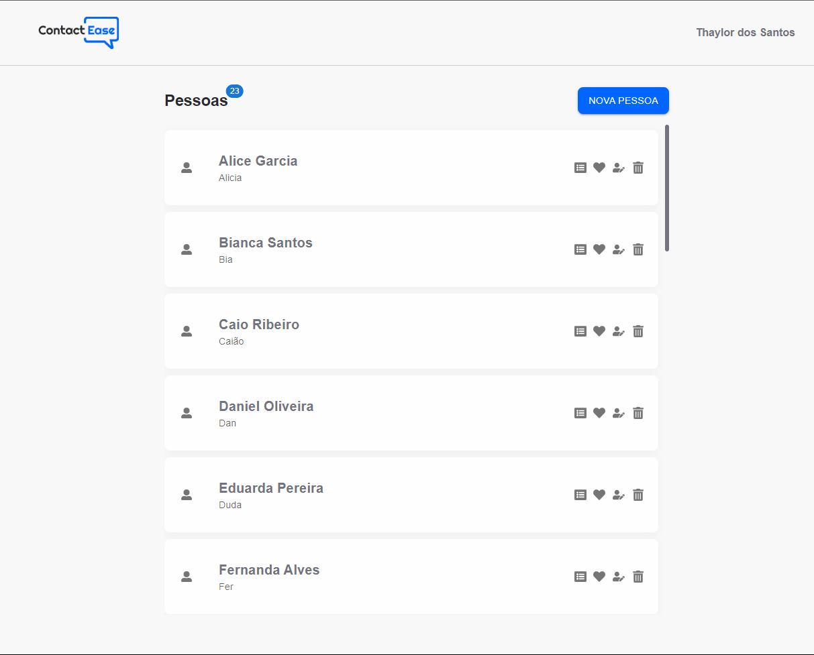
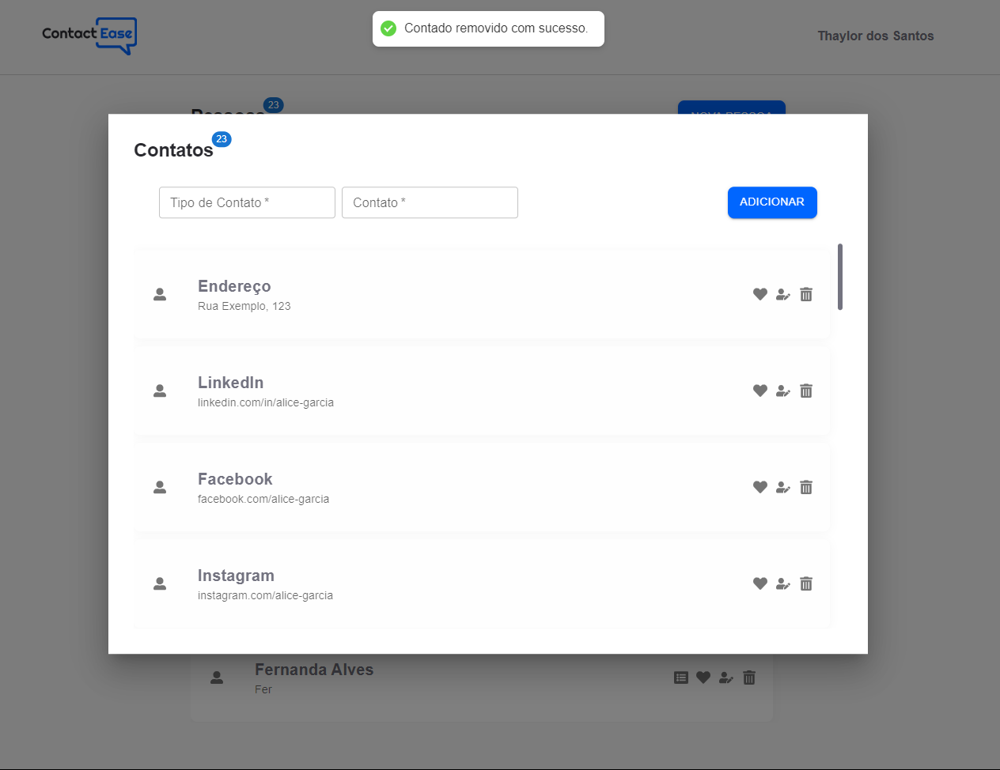

Este projeto foi desenvolvido como parte de um processo seletivo, com o objetivo de criar um aplicativo web que explore a API de contatos desenvolvida. Para a construção dos componentes do projeto, foi utilizado o framework React, que permite a criação de interfaces de usuário eficientes e interativas. Além disso, o Axios foi empregado para realizar as chamadas à API, facilitando a comunicação entre o aplicativo e o backend. Para estilizar e fornecer componentes visuais consistentes, foi utilizada a biblioteca Material-UI, que oferece uma ampla gama de componentes prontos para uso.

Este projeto foi hospedado na plataforma Vercel e pode ser acessado por meio do link [Contact Ease](https://contact-ease-web.vercel.app/)

